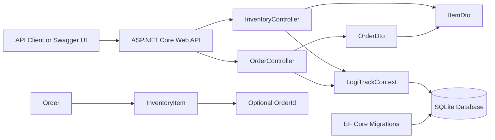

# LogiTrack Architecture

LogiTrack is an ASP.NET Core Web API backed by Entity Framework Core and SQLite. The application separates HTTP contracts from persistence entities with DTOs and exposes inventory and order operations through controller endpoints.

## Request Flow

1. A client or Swagger UI sends an HTTP request to an API route.
2. The appropriate controller validates the request and maps incoming DTO data to EF Core entities.
3. `LogiTrackContext` performs asynchronous database operations against SQLite.
4. Controller actions map persisted entities back to DTOs before returning JSON responses.
5. Swagger/OpenAPI documents the available routes for interactive testing in development.

## Persistence Model

- `Order` represents a customer order and contains a collection of `InventoryItem` records.
- `InventoryItem` stores the item name, quantity, location, and optional `OrderId` foreign key.
- EF Core migrations track changes to the SQLite schema.
- Startup seeding creates sample inventory and order data when the database is empty.
