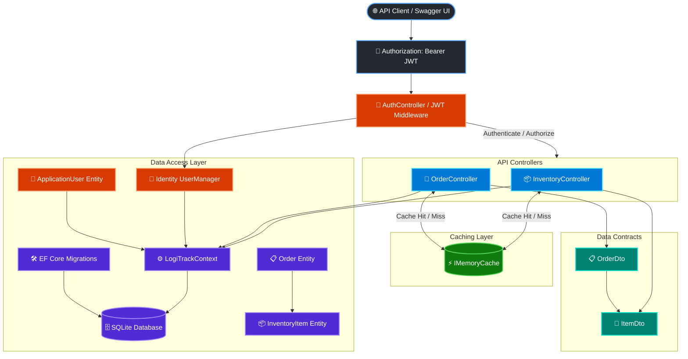

# LogiTrack Architecture

LogiTrack is an ASP.NET Core Web API backed by Entity Framework Core, ASP.NET Core Identity, and SQLite. The application secures routes with JWT authentication, caches read endpoints with `IMemoryCache`, separates HTTP contracts from persistence entities with DTOs, and exposes operations through controller endpoints.

## Request Flow

1. A client or Swagger UI sends an HTTP request with a `Bearer <JWT>` token in the `Authorization` header.
2. The JWT Middleware authenticates the request and validates claims/roles (`[Authorize]`).
3. For GET endpoints (`/api/inventory`, `/api/order`), the controller checks `IMemoryCache`:
   - **Cache Hit:** Returns cached DTO response immediately without querying the database.
   - **Cache Miss:** Queries `LogiTrackContext` using `.AsNoTracking()` and direct LINQ `.Select()` projections, stores the result in `IMemoryCache` with a 30-second sliding/absolute policy, and returns the response.
4. Mutation endpoints (`POST`, `DELETE`) write changes to `LogiTrackContext`, persist to SQLite, and invalidate the corresponding cache entries.
5. Swagger/OpenAPI documents available routes and provides Bearer token authorization support.

## Persistence & Security Model

- **Identity & Auth:** `ApplicationUser` extends `IdentityUser`. `AuthController` handles registration and login, issuing signed JWT tokens.
- **Entities & Relationships:** `Order` represents a customer order and contains a collection of `InventoryItem` records. `InventoryItem` stores item details and an optional `OrderId` foreign key.
- **Caching & Query Optimization:** Direct LINQ projections prevent over-fetching entity columns, and `IMemoryCache` minimizes database roundtrips for repeated read requests.
- **Migrations & Seeding:** EF Core migrations track database schema changes. Startup logic seeds default inventory, orders, and identity roles when empty.
